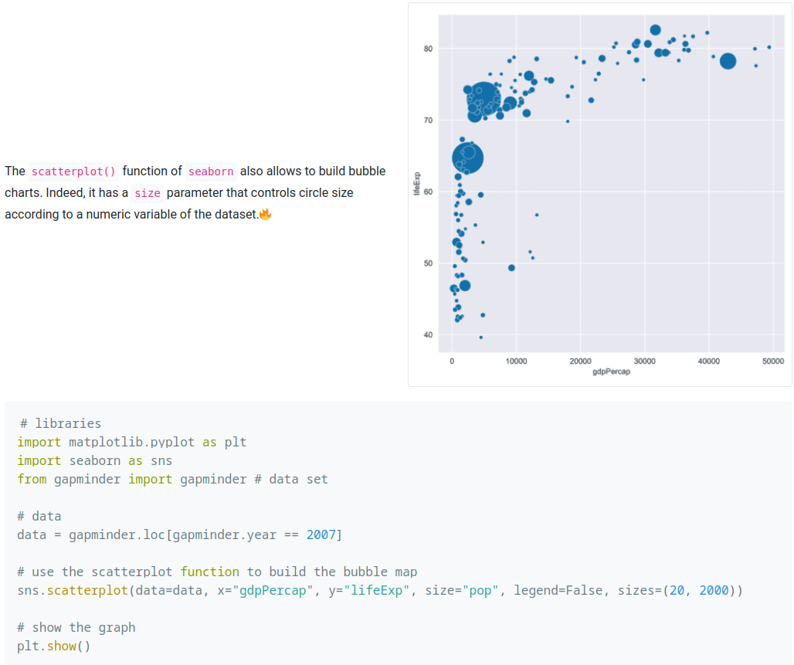

# Create a bubble plot for skill

https://www.python-graph-gallery.com/bubble-plot/

## Goal
Getting clear view of how our skills aligned with our goal so that we can decide what to do next.

## Steps

First lets choose 3 variables:
1. Benefit
2. Difficulty
3. Mastery

x axis would be benefit
y axis would be difficulty
bubble size would be mastery

Required time: 3-6 hours?
Platform: Jupyterlab, Pandas, Matplotlib, Seaborn

## Measuring Benefit
Value range: 0-12
Criteria:
1. What is it used for?
2. Will it improve my career?
3. How does it affect my well being?
4. Will you use it most of the time?
5. What opportunity will be lost if I don't learn this skill?
6. Is it supported by good community and steadily improve?

## Measuring Difficulty
Value range: 0-10
Criteria:
1. Is it easy to get started?
2. Is it easy to remember the syntax?
3. How is the tutorial? Is it cover various cases?
4. How many good and free tutorial out there?
5. How popular is it?

## Measuring Mastery
Value range: 0-10
Criteria:
1. Can you use it immediately? It is fine if you need to just take a peek on a cheat sheet.
2. Do you feel burdened when trying to use it?
3. Are you comfortable using it from time to time?
4. Do you have the feeling that you are in control?
5. Did you feel like you could use it to advanced level?