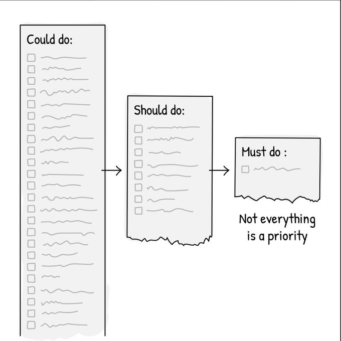

1. Add through subtraction.
> Burnout often manifests itself as stagnancy. When you do too much you kneecap your mental and creative capacity.
> Audit your commitments and aggressively cut out the things from your life that are siphoning your energy.

2. Examine your passion.
> The reason you feel stuck could be because you have lost touch with what you want out life these days.
> Without passion, action that results in progress becomes mundane.
> Take time to honestly reflect on what you really want and then go after it.

3. Stop forcing only fastballs.
> If everyday, you continue hammering away the same boring routine, it's like a pitcher who throws only fastballs with no variety – this is a recipe for failure.
> Throw a 'change-up' and mix up your routines. Add variety and spice up your day.

4. Understand you are not alone.
> Accept 'stagnancy' for what it is – transient and temporary. Everyone stagnates at some point in their life.
> When you recognize this, that perspective allows you to stop vilifying yourself and start moving forward productively.

5. Pause and take a breath.
> Burnout pre-dominantly plagues high-achievers. Even if you are pursuing that which you love it's possible that you still need a break.
> Give yourself permission to pause, get away, re-focus, and then comeback stronger than ever.

6. Reject 'paralysis-by-analysis'
> For many, overthinking stands to be the root cause for stagnancy. Instead, train yourself to 'go with the flow' and accept not everything can be controlled
> Yes, you still need to plan, but you don't need to have everything figured out.
> Personal note: be more decisive!

7. Action trumps theory.
> It's essential to find the root cause of why you feel stuck, but stopping there will be futile.
> "A body at rest will remain at rest". That means you must take action, regardless of your emotion, to break the cycle of despair. It gets easier.

8. Stack Wins
> Release from your mind the idea that you must provide top-tier results and progress every day or else it was a waste. That's unrealistic and draining.
> Crawl if you must but don't stop. Progress, no matter how small, is still progress.

