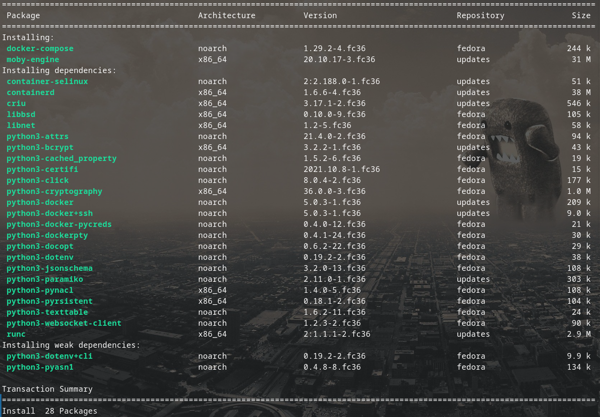

# Docker installation on Fedora 36
#docker #container #fedora #moby #getstarted


3 possible way:
1. Use docker-engine, add docker repo then install
2. Use podman, this is a new and not much known
3. Use moby-engine which already available in Fedora and seems to run just like the usual docker. This is the preferred way.

 The Docker Engine is FLOSS and it’s also available as a package directly from Fedora’s repositories. This package is called [Moby](https://mobyproject.org/).
 
## Moby installation on Fedora
 
 ```bash
$ sudo dnf install moby-engine docker-compose
$ sudo systemctl enable docker
```

this will give you all the tools you need and make sure Docker service start at startup


```bash
$ sudo groupadd docker
$ sudo usermod -aG docker $USER
```

Docker is a system-wide service, which has itself root permisions and which also requires root-permisions to interact with. For a developer, it's normally not a big risk to add yourself to the 'docker'-group, so that you don't have to type `sudo` whenever interacting with Docker.

then reboot.

###  Benefits
The Moby Engine version does not entail any
 
## Hello World
 
 ```bash
$ docker run hello-world
```

## composing a project
based on docker compose tutorial

docker-compose.yaml
```yaml
version: "3.7"
services:
  caddy:
    container_name: "caddy"
    image: "caddy:latest"
    ports:
      - "80:80"
```

run `docker-compose up -d` and go to http://localhost to check if it is working, to shut down `docker-compose down` in the same directory as `docker-compose.yaml`
 
## reference

https://adamtheautomator.com/docker-compose-tutorial/
https://fedoramagazine.org/docker-and-fedora-35/