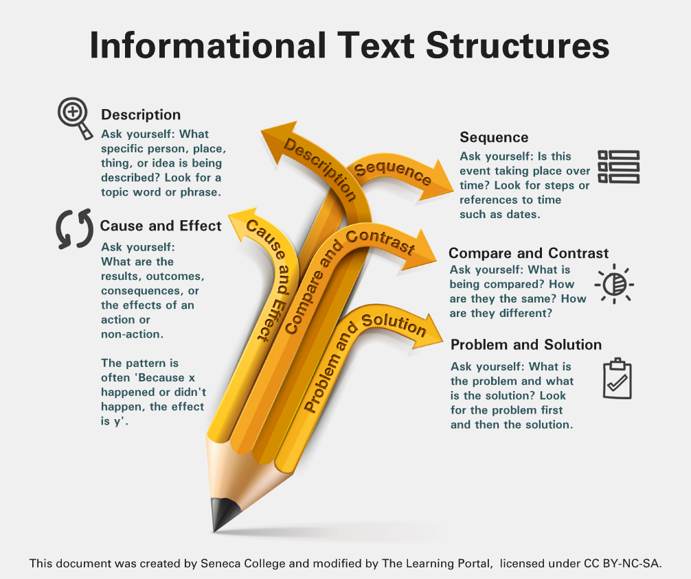

From *Handbook of Technical Writing 9th ed*

[[Five Steps to Successful Writing - A Pre-writing Template]]

Successful writing on the job is not the product of inspiration, nor is it merely the spoken word converted to print; it is the result of **knowing how to structure information** using both **text** and **design** to **achieve an intended purpose** for a **clearly defined audience**.

## 1. Preparation
   - Establish your primary purpose.
   - Assess your audience (or readers) and the context.
   - Determine the scope of your coverage.
   - Select the appropriate medium.
     
  **Establishing Your Purpose.** Ask yourself what you want your readers to know, to believe, or to be able to do after they have finished reading what you have been written. Be Precise.
  
  **Assessing Your Audience and Context.** 
  Assess your audience --> be precise and ask key questions.
  - Who exactly is your reader?
  - Do you have multiple readers?
  - Who needs to see or to use the document?
  - What are your readers' needs in relation to your subject?
  - What are their attitudes about the subject? (Skeptical? Supportive? Anxious? Bored?)
  - What do your readers already know about the subject?
  - Should you define basic terminology, or will such definitions merely bore, or even impede, your readers?
  - Are you communicating with international readers and therefore dealing with issues inherent in global communcation?
  
  Context --> the environment or circumstances in which writers produce documents and **within which readers interpret their meaning.** Everything is written in a context.

**Determining the Scope.**
Determining your purpose + assesing readers and context
--> help you decide what to include and what not to include in your writing.

not clearly defined scope --> needless hours on research -->  because not sure what kind of information you need or even how much.

**Selecting the Medium.**
Finally, you need to determine the most appropriate medium for communicating your message.
The most important considerations --> audience and purpose of the communication.

## 2. Research
The only way to be sure that you can write about a complex subject is to thoroughly understand it.
Research methods:
- conducting extensive investigation:
	- interviewing
	- library and internet search
	- careful note-taking
- simply checking a web site and jotting down points.

**Methods of Research.**
Depend on the types of sources:
1. Primary research
   Gathering of raw data compiled from interviews, direct observation, surveys, experiments, questionnaires, and audio and video recordings.
2. Secondary Research
   Gathering information that has been analyzed, assessed, evaluated, compiled, or otherwise organized into accessible form. Such forms or sources include books, articles, reports, Web documents, e-mail discussions, and brochures.

**Sources of Information.**
- Your own knowledge and that of your colleagues
- The knowledge of people outside your workplace, gathered through `interviewing for information`
- Internet sources, including Web sites, directories, archives, and discussion groups
- Library resources, including databases and indexes of articles as well as books and reference works
- Printed and electronic sources in the workplace, such as various correspondce, reports, and Web intranet documents

> **Remember to document your sources.**

## 3. Organization
No organization --> the material gathered during research will be incoherent to your readers.
To organize information effectively --> need to determine the best way to structure your ideas; that is, you must choose a primary **method of development**.

**Methods of Development**
- An `appropriate method of development` is the writer's tool for keeping information under control and the readers' means of following the writer's presentation.
- As you analyze the information you have gathered, choose the method that best suits:
	- your subject,
	- your readers' needs, and
	- your purpose
	Example:
	1. Instruction --> `sequential method of development`
	2. About history --> `chronological method of development`
	3. Often you will need to combine methods of development.
	   For example: A persuasive brochure for a charitable organization might combine a `specific-to-general method of development` with a `cause-and-effect method of development`. That is, you could begin with persuasive case histories of individual people in need and then move to general information about the positive effects of donations on recipients.

**Outlining**
--> breaks large or complex subjects into manageable parts.
--> enables you to emphasize key points by placing them in the positions of greatest importance.

By structuring your thinking at an early stage, a **well-developed outline ensures** that your document will be **complete** and **logically organized**, allowing you to focus exclusively on writing when you begin the rough draft.

An outline can be especially helpful for maintaining a collaborative-writing teams's focus throughout a large project.

At this point, you must begin to consider layout and design elements that will be helpful to your readers and appropriate to your subject and purpose. Where the photographs, tables? How headings an lists arranged.

## 4. Writing
Established `purpose`, `readers' needs`, `scope`, and have completed `research` and `outline` --> Write first draft:
- Expand outline into paragraphs, without worrying about grammar, refinements of language usage, or punctuation.
- Writing and revising are different activities; refinements come with revision.

Write the rough draft, concentrating entirely on converting your outline into sentences and paragraphs.

You might try writing as though you were explaining your subject to a reader sitting across from you.

Do not worry about good opening. Just start.
Do not be concerned in the rough draft about exact word choice unless it comes quickly and easily -- concentrate instead on ideas.

Even with good preparation, writing the draft remains a chore for many writers. The most effective way to get started and keep going is to **use your outline as a map for your first draft**.

Consider **writing an introduction last** because then you will know more precisely what is in the body of the draft. Your opening should **announce the subject** and give readers **essential backgound information**, such as the document's primary purpose. For longer documents, an introduction should **serve as a frame** into which readers can **fit the detailed information that follows.**

Conclusion: ties the main ideas together and emphatically makes a final significant point.
The final point could be:
- to recommend a course of action.
- make a prediction or a judgment
- or merely summarize your main points

## 5. Revision
Read and evaluate the draft as if you were a reader seeing it for the first time.

Check your draft for accuracy, completeness, and effectiveness in achieving your purpose and meeting your readers needs and expectations.

Trim extraneous information: Your writing should give readers exactly what they need, but it should not burden them with unnecessary information or sidetrack them into loosely related subjects.

- Do not try to revise for everything at once.
- Read your draft several times, each time looking for and correcting a different set of problems or errors.
- Concentrate first on larger issues, such as **unity** and **coherence**;
  save mechanical corrections, like **spelling** and **puctuation**, for later **proofreading**.

## Other references

https://saylordotorg.github.io/text_business-english-for-success/index.html
