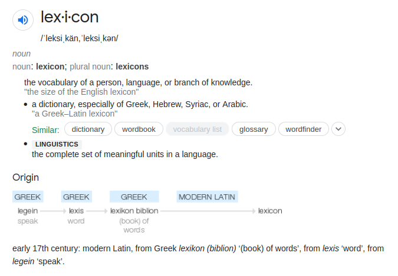
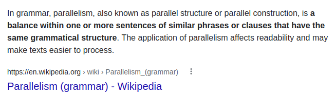
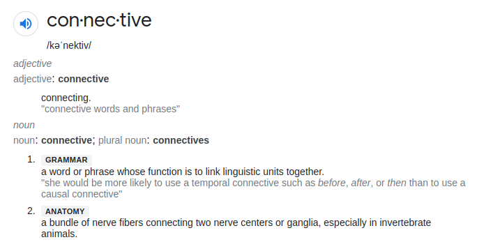

Source: [10.11114/jets.v6i6.3111](10.11114-jets.v6i6.3111.pdf)

Listening & Reading --> Perceptive (decoding)
Speaking & Writing --> Productive (encoding)

Perceptive --> guess the meaning
Productive --> Produced language on their own

In the process of:
- Perceptive skills --> exposed to input by some sources of information such as teachers, TV, noticeboards, so on and so forth.
- Productive skills --> students' lexicon (decoding) is activated during the production process of the activity.

#### Difficulty of Writing
- Writing is a complex skill, and its development involves much more than the accurate use of grammar and a good range of vocabulary.
- As writing allows writers to explore feelings, ideas and thoughts, it is considered as a complex and hard process.
  For English learners as Foreign or Secondary Language learners, it is a fact that writing is a very difficult task because it forces the learners' feelings ideas and thoughts to concentrate which involves great effort, skill and ability.
  To write effectively, it is needed to take many things into mind in pre, while, and post writing.

#### Organization of a Good Writing
While analyzing students' written works we noticed that they could not organize material in their compositions. Organizing ideas in a written form can be achieved by learning three main qualities of the text: 1) Outlining, 2) Coherence and 3) Unity.

1. **Outline**
   - Simply, an outline is basically an organized list of expression ideas, thoughts and items. 
   - Frank (1980) says, "constant use of an outline makes students aware of the need for their composition."
   - Good outline requires logical coordination, and grammatic parallelism.
   

   
2. **Coherence**
   - It can be basically described as logical and orderly arrangement of all the ideas.
   - Gallo (1973), "Coherence is the glue that joins the ideas together"
   - Blass and Durighello (1985), "Coherence allows the reader to follow the writer's thoughts through a  logical series of sentences and paragraphs"
   
   To achieve coherence:
   - The right conective is very important to sentence meaning.
   - Variety in the usage of connectives leads to more effective expression, choosing the right conjunction is essential for conveying meaning accurately.

3. **Unity**
- Oshima and Hogue (1981) indicate that, "when we talk about paragraph unity we mean that you should discuss only one main idea in each paragraph"
- Eells (1942) says that by unity it is meant that each paragraph should have one central and main idea.
- Bander (1985), "A paragraph which has all its sentences focusing on one idea is said to have unity."
  That is, if the **dominating idea** can cover the whole composition it can be said that it has unity. The **main** or **dominating idea** can be defined as a controlling idea that tells what the main subject of a paragraph or composition will be and indicates how the paragraph or composition will be developed.
- The topic sentence, controlling idea, and minor and major support sentences, are fundamental elements for unity in a paragraph or a composition.