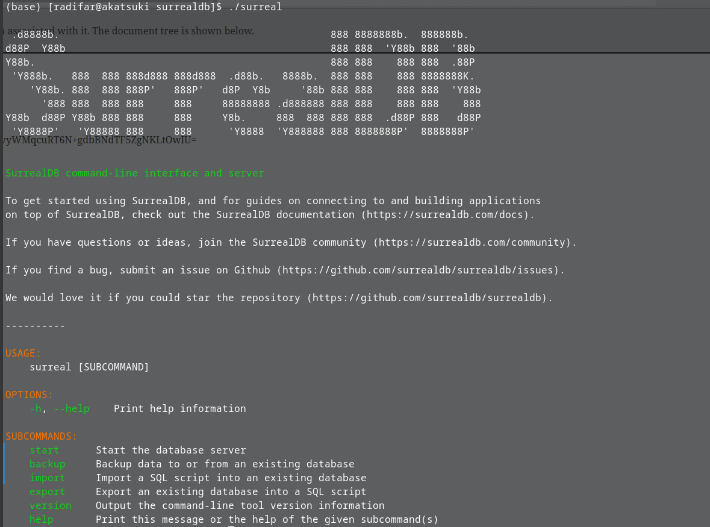

# Getting Started
#docker #surrealdb #getstarted #graphdb #temporaldb

Requirements:
- Docker

## What is it
Temporal Graph Database, also support document and key-value

## Plan
Learn how to install, running, configuring, CRUD

## Steps
```bash
docker run --rm -p 8000:8000 surrealdb/surrealdb:latest start
```

surrealdb container not working:
```bash
(base) \[radifar@akatsuki ~\]$ docker run --rm -p 8000:8000 surrealdb/surrealdb:latest start  
docker: Error response from daemon: failed to create shim task: OCI runtime create failed: runc create failed: unable to sta  
rt container process: exec: "/surreal": permission denied: unknown.
```

So instead I download the surreal binary using the [shell installation script](https://install.surrealdb.com/). Then I found the download link for my system: https://download.surrealdb.com/v1.0.0-beta.2/surreal-v1.0.0-beta.2.linux-amd64.tgz

Next, extract and execute, voila



Next, start surreal for real

```bash
base) [radifar@akatsuki surrealdb]$ ./surreal start --log trace --user radifar --pass mypass memory

 .d8888b.                                             888 8888888b.  888888b.
d88P  Y88b                                            888 888  'Y88b 888  '88b
Y88b.                                                 888 888    888 888  .88P
 'Y888b.   888  888 888d888 888d888  .d88b.   8888b.  888 888    888 8888888K.
    'Y88b. 888  888 888P'   888P'   d8P  Y8b     '88b 888 888    888 888  'Y88b
      '888 888  888 888     888     88888888 .d888888 888 888    888 888    888
Y88b  d88P Y88b 888 888     888     Y8b.     888  888 888 888  .d88P 888   d88P
 'Y8888P'   'Y88888 888     888      'Y8888  'Y888888 888 8888888P'  8888888P'


[2022-07-24 07:08:06] INFO  surrealdb::kvs Starting kvs store in memory
[2022-07-24 07:08:06] INFO  surrealdb::kvs Started kvs store in memory
[2022-07-24 07:08:06] INFO  surrealdb::net Starting web server on 0.0.0.0:8000
[2022-07-24 07:08:06] INFO  surrealdb::net Started web server on 0.0.0.0:8000
```

Update: SurrealDB just got updated to 1.0.0-beta3, and docker still error (2022-07-24-08:43).

## What's next
Use it for PROOVen Data model
