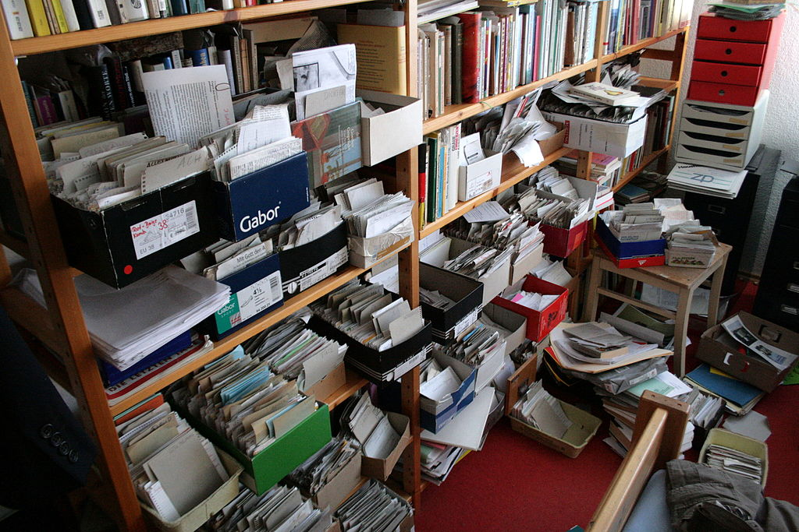

- A good structure is something you can trust. It relieves you from the burden of remembering and keeping track of everything.
- If you can trust the system, you can let go of the attempt to hold everything together in your head and you can start focusing on what is important:
    - The content
    - The argument
    - The ideas.
- By breaking down the amorphous task of _writing a paper_ into small and clearly separated tasks, you can focus on one thing at a time, complete each in one go and move on to the next one.
- A good structure enables _flow_.
- A good, structured workflow puts us back in charge and increase our freedom to do the right thing at the right time.

- Clear structure **≠** Good plan
    Plan → Impose a structure on us; it makes you inflexible.
                To keep going according to plan, you have to push yourself and employ willpower. This is not only demotivating, but also unsuitable for an open-ended process like research, thinking or studying in general, where we have to adjust our next steps with every new insight, understanding or achievement.

- Planner vs Expert
    - Universities try to turn students into planners.
    - Planning will get you through your exams if you stick to them and push through.
    - Planners are also unlikely to continue with their studies after they finish their examinations. They are rather glad it is over.
    - Experts would not even consider voluntarily giving up what has already proved to be rewarding and fund: learning in a way that generates real insight, is accumulative and sparks new ideas.

# Good Solutions are Simple – and Unexpected
There is no need to build a complex system and there is no need to reorganise everything you already have. You can start working and developing ideas immediately by taking smart notes.

Even the best tool will not improve your productivity considerably if you don't change your daily routines the tool is embedded in.

Only when all the related work becomes part of an **overarching and interlocked process,** where all bottlenecks are removed, can significant change take place.

## Overarching workflow
It is a great insight of David Allen's **Getting Work Done** (Allen, 2001).
- GTD principle → collect everything that needs to be taken care of in one place and process it in a standardised way → forces us to make clear choices and regularly check if our tasks still fit into the bigger picture.
- Only if we know that everything is taken care of, from the important to the trivial, can we let go and focus on what is right in front of us.
- Only if nothing else is lingering in our working memory and taking up valuable mental resources can we experience what Allen calls a _mind like water_ – the state where we can focus on the work right in front of us without getting distracted by competing thougths.
- It provide structure for our everyday work that deals with the fact that most distractions do not come so much from our environment, but our own minds.

Unfortunately, David Allen's technique cannot simply be transfered to the task of insightful writing, because:
1. GTD relies on clearly defined objectives, whereas insight cannot be predetermined by definition. We usually start with rather vague ideas that are bound to change until they become clearer in the course of our research.
2. GTD requires projects to be broken down into smaller, concrete _next steps_. Insightful writing or academic work is also done one step at a time, but these are most often too small to be worth writing down (looking up footnote, rereading a chapter, writing a paragraph) or too grand to be finished in one go.
3. It is also difficult to anticipate which step has to be taken after the next one. You might notice a footnote, which you check quickly on. You try to understand a paragraph and need to look up something for clarification. You make a note, go back to reading and then jump up to write down a sentence that formed itself in your mind.

Writing is not a linear process. We constantly have to jump back and forth between different tasks. It wouldn't make any sense to micromanage ourselves on that level.
Zooming out to the bigger picture does not really help, either, because then we have next steps like "writing a page". That does not really help with navigating the tings you have to do to write a page, often a whole bunch of other things that can take an hour or a month.

The takeaway message from Allen → the secret to a successful organization lies in the holistic perspective.
Everything needs to be taken care of, otherwise the neglected bits will nag us until the unimportant tasks become urgent.
Even the best tools won't make much of a difference if they are used in isolation. Only if they are embedded in a well-conceived working process can the tools play out their strengths. There is no point in having a great tools if they don't fit together.

## Integrating GTD to writing
When it comes to writing, everything, from research to proofreading, is closely connected.

All the little steps must be linked in a way that will enable you to go seamlessly from one task to another, but still be kept separate enough to enable us to flexibly do what needs to be done in any given situation.
→ This is the other insight of David Allen:
Only if you can trust your system, only if you know that everything will be taken care of, will your brain let go and let you focus on the task at hand.

That is why we need a note-taking system that is as comprehensive as GTD, but one that is suitable for the open-ended process of writing, learning and thinking. Enter the slip-box.

# The Slip-box

A physical zettelkasten by [Kai Schreiber](https://www.flickr.com/people/50457550@N00)

1960s, Among the staff of a German administration office, the son of a brewer. Niklas Luhmann [^1]→ Law school → public servant.
After 9-5 shift → go home → reading and following his diverse interests in philosophy, organizational theory and sociology.

Encountered something remarkable OR had a thought about what he read → made a note.

After a while realized → his note-taking was not leading anywhere.
→ wrote them all on small pieces of paper, put a number in the corner and collected them in one place: the slip-box.

## Effortless - wei wu wei

Hard work can be fun as long as it is aligned with our intrinsic goals and we feel in control. The problems arise when we set up our work in such an inflexible way that we can't adjust it when things change and become arrested in a process that seems to develop a life of its own.

The best way to maintain the feeling of being in control is to stay in control. And to stay in control, it's **better to keep your options open** during the writing process rather than limit yourself to your first idea.

It is in the nature of writing, especially insight-oriented writing, that questions chage, the material we work with turns out to be very different from the one imagined or that new ideas emerge, which might change our whole perspective on what we do.
→ Only if the work is set up in a way that is flexible enough to allow these small and constant adjusments can we keep our interest, motivation, and work aligned – which is the precondition to effortless or almost effortless work [^2].

## Smart working environment – Overarching workflow

Luhmann was able to focus on the important things right in front of hime, pick up quickly where he left off and stay in control of the process because the **structure of his work allowed him to do this**.

Success is the result of smart working environments that avoid resistance in the first place. Instead of struggling with adverse dynamics, highly productive people deflect resistance.

This is **not just about having the right mindset**, it is also about **having the right workflow**.

It is the way Luhmann and his slip-box worked together that allowed him to move freely and flexibly between different tasks and levels of thinking. It is about **having the right tools** and **knowing how to use them** – and very few understand that **you need both**.

# The slip-box manual

Two slip-boxes:
1. A bibliographical notes → contained the references and brief notes on the content of the literature
2. Main notes → collected and generated his ideas, mainly in response to what he read.

The notes were written on index cards and stored in wooden boxes.

Workflow:
1. Whenever he read something, he would write the bibliographi information on one side of a card and make brief notes about the content on the other side. These notes would end up in the bibliographical slip-box.
2. Shortly after, he would look at his brief notes and think about their relevance for his own thinking and writing.
3. He then would turn to the main slip-box and write his ideas, comments and thoughts on new pieces of paper, using only one for each idea and restricting himself to one side of the paper, to make it easier to read them later without having to take them out of the box.
4. He usually wrote his notes with an eye towards already existing notes in the slip-box (see if there is a connection?).
5. More often than not, a new note would directly follow up on another note and would become part of longer chain of notes.
6. Add references to note somewhere else in the slip-box, some of them which were located nearby, others in completely different areas and contexts. Rarely would a note stay in isolation.
7. He did not just copy ideas or quotes from the texts he read, but made a transition from one context to another. It was very much like a translation where you use different words that fit a different context, but strive to keep the original meaning as truthfully as possible.
8. The trick is that he did not organise his notes by topic, but in the rather abstract way of giving them fixed numbers. The numbers bore no meaning and were only there to **identify** each note **permanently**.
9. Whenever he added a note, he **checked his slip-box for other relevant notes to make possible connections between them**. Adding a note directly behind another note is only one way of doing this. Another way is by **adding a link** on this and/or the other note, which could be anywhere in the system.
10. By adding links between notes → able to add the same note to different contexts.
11. The last element --> index, from which he would refer to one or two notes that would serve as a kind of entry point into a line of thought or topic. Notes with a sorted collection of links are, of course, good entry points.

[^1]: December 8, 1927 – November 6, 1998
[^2]: Like wei wu wei (doing not doing) concept in Taoism