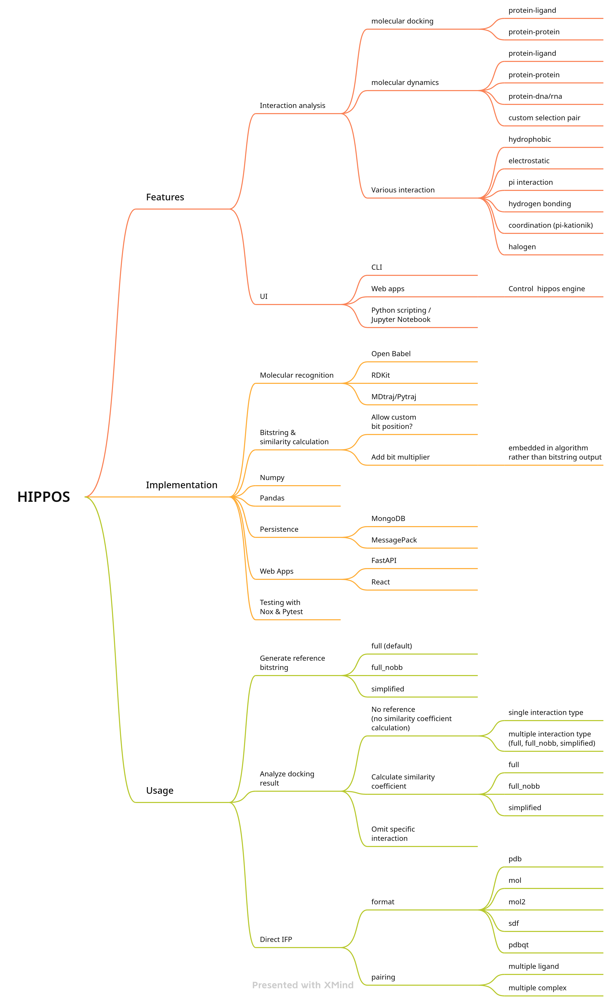

# HIPPOS concepts and roadmap

Random Ideas:
1. Understand how object represented in iPython/Jupyter Notebook
2. For omit residue, rather than changing the data on the flow, it would be much simpler if we could use a filter (mask) bitstring.
3. Integrate 
4. Use YAML as config, allow change specific parameter (eg. H bond distance) via this config.
5. Use Pydantic as config management.
6. Use Typer & Rich for more manageable and pretty CLI.