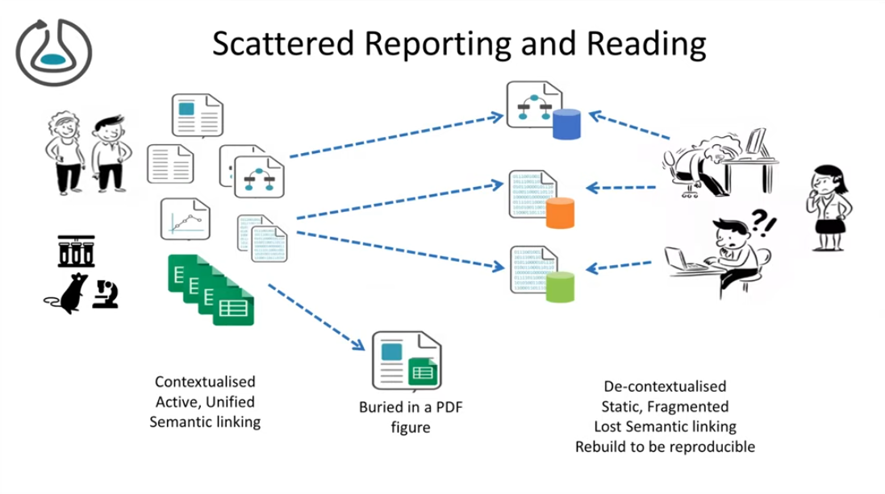

# RO-crate paper summary
#ro-crate #summary #paper #prooven

- Back then reproducibility only can be achieved through **pointers to** and **descriptions of** datasets, software and methods in their publications.
- However, scientific articles may be ambiguous, incomplete and difficult to process by automated systems.
- RO-crate → **open**, **community-driven**, and **lightweight** approach to packaging research artefacts along with their metadata in a **machine readable** manner.
- Based on Schema.org annotations in JSON-LD ⇒ Establish best practices to formally describe metadata in an **accessible** and **practical** way for their use in a wide variety of situations.

- A structured archive of **all the items** that contributed to a research outcome, including their identifiers, provenance, relations and annotations.
- By applying **"just enough"** Linked Data standards, RO-Crate simplifies the process of making research outputs FAIR while also enhancing research reproducibility.

## Introduction

- open science movement → need and demand for the publication of **artefacts of the research process**.
- publication of these assets:
    - software
    - workflows
    - data
    should follow the FAIR principles.
- Important examples:
    - data publication with rich metadata (e.g. Zenodo)
    - domain-specific data deposition (e.g. PDB)
    - use common practices in reproducible research software (e.g. use of containers)
    While these platforms are useful, must put greater emphasis on the **interconnection of the multiple artefacts** that make up the research process.
- Research Objects was introduced to **address this connectivity** as:
    - **semantically rich aggregations** of (potentially distributed) resources that **provide a layer of structure** over a research study and are
    - delivered in a _machine-readable_ format.
    - require a large technology stack, and typically tailored to a particular platform and are also not **easily usable by end-users**.

- To address this gap → **RO-Crate** - an _approach to package and aggregate research artefacts with their metadata and relationships_.

Paper structure:
1. RO-Crate introduction, its purpose and context;
2. Guide to the RO-Crate community and tooling;
3. Exemplar usage of RO-Crate => demonstrating its value as connective tissue for different artefacts from different communities.

## RO-Crate

### _Conceptual definition_

#### Linked Data as a foundation

#### RO-Crate is a self-described container

#### Data Entities are described using Contextual Entities

#### Guide through Recommended Practices

#### Ensuring Simplicity

#### Extensibility and RO-Crate profiles

### _Technical implementation of the RO-Crate model_

#### RO-Crate JSON-LD

#### Flattened JSON-LD

#### JSON-LD context

### _RO-Crate Community_

#### People

#### Norms

#### Open Platforms

## RO-Crate Tooling

## Profiles of RO-Crate in use

### _Bioinformatics workflows_

#### Profile for describing workflows

#### Profile for recording workflow runs

#### Profile for testing workflows

### _Regulatory Sciences_

### _Digital Humanities: Cultural Heritage_

### _Machine-actionable Data Management Plans_

### _Institutional data repositories – Harvard Data Commons_

## Related Work

### _Building and Packaging Digital Research Artefacts_

### _FAIR Digital Objects_

### _Packaging Workflows_

## Conclusion

