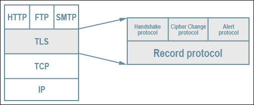
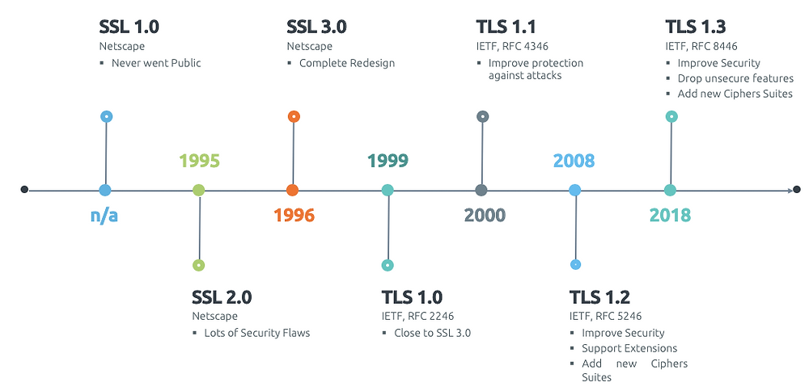

# Networking 101, chapter 4 - Transport Layer Security (TLS)

source: https://commons.wikimedia.org/wiki/File:TLS_protocol_stack.svg

> Note: When the SSL protocol was standardized by the IETF, it was renamed to Transport Layer Security (TLS). Many use the TLS and SSL names interchangeably, **but technically, they are different**, since each describes a different version of the protocol.

source: https://www.networkdatapedia.com/post/3-things-you-should-know-about-https-ssltls-traffic-with-wireshark

some performance-critical features, such as HTTP/2, explicitly require the use of TLS 1.2 or higher and will abort the connection otherwise. Good security and performance go hand in hand.

> Note: TLS was designed to operate on top of a reliable transport protocol such as TCP. However, it has also been adapted to run over datagram protocols such as UDP. The **Datagram Transport Layer Security (DTLS)** protocol (RFC 6347) is based on TLS and able to provide similar security while preserving the datagram delivery model.

## Encryption, Authentication, and Integrity

In practice, secure web application will leverage all three services:
1. Encryption → A mechanism to obfuscate what is sent from one host to another.
2. Authentication → A mechanism to verify the validity of provided identification material
3. Integrity → A mechanism to detect message tampering and forgery

cryptographically secure data channel → the connetion peers MUST AGREE on which ciphersuites will be used an the keys used to encrypt the data. TLS specifies handshake sequence to perform this exchange.

The ingenious part of this handshake, and the reason TLS works in practice, is due to its use of public key cryptography (also known as asymmetric key cryptography), which **allows the peers to negotiate a shared secret key without having to establish any prior knowledge of each other, and to do so over an unencrypted channel.**

As part of the TLS handshake, the protocol also allows both peers to authenticate their identity. When used in the browser, this authentication mechanism allows the client to verify that the server is who it claims to be (e.g., your bank) and not someone simply pretending to be the destination by spoofing its name or IP address. This verification is based on the established chain of trust — see [Chain of Trust and Certificate Authorities](https://hpbn.co/transport-layer-security-tls/#chain-of-trust-and-certificate-authorities). In addition, the server can also optionally verify the identity of the client — e.g., a company proxy server can authenticate all employees, each of whom could have their own unique certificate signed by the company.

Finally, with encryption and authentication in place, the TLS protocol also provides its own message framing mechanism and signs each message with a **message authentication code (MAC)**. The MAC algorithm is a one-way cryptographic hash function (**effectively a checksum**), the keys to which are negotiated by both connection peers. **Whenever a TLS record is sent, a MAC value is generated and appended for that message**, and the receiver is then able to compute and verify the sent MAC value **to ensure message integrity and authenticity**.

## HTTPS everywhere

- HTTPS protects the integrity of the website
- HTTPS protects the privacy and security of the user
- HTTPS enables powerful features on the web

> Note: Let’s Encrypt is a free, automated, and open certificate authority brought to you by the Internet Security Research Group (ISRG). The objective of Let’s Encrypt and the ACME protocol is to make it possible to set up an HTTPS server and have it automatically obtain a browser-trusted certificate, without any human intervention. Visit the project website to learn how to set it up on your own site. There are no restrictions, now anyone can obtain a trusted certificate for their site, free of charge.

HTTPS = HTTP + TLS
SMTPS = SMTP + TLS
FTPS = FTP + TLS

## TLS Handshake

negotiation of encrypted tunnel:
- version of TLS protocol
- choose the ciphersuite
- verify certificates if necessary
unfortunately, each of these steps requires new packet roundtrips --> adds startup latency to all TLS connections.

1-RTT TLS handshake is possible via:
- TLS False Start
- abbreviated handshake if there is previous communication (TLS Session Resumption)

> Note: One of the design goals for TLS 1.3 is to reduce the latency overhead for setting up the secure connection: 1-RTT for new, and 0-RTT for resumed sessions!

### RSA, Diffie-Hellman and Forward Secrecy

### Application Layer Protocol Negotiation (ALPN)

### Server Name Indication (SNI)

## TLS Session Resumption

### Session Identifiers

### Session Tickets

## Chain of Trust and Certificate Authorities

## Certificate Revocation

### Certificate Revocation List (CRL)

### Online Certificate Status Protocol (OCSP)

### OCSP Stapling

## TLS Record Protocol

## Optimizing for TLS

### Reduce Computational Costs

### Enable 1-RTT TLS Handshakes

### Optimize Connection Reuse

### Leverage Early Termination

### Configure Session Caching and Stateless Resumption

### Enable TLS False Start

### Optimize TLS Record Size

### Optimize the Certificate Chain

### Configure OCSP Stapling

### Enable HTTP Stric Transport Security (HSTS)

### Enable HTTP Public Key Pinning (HPKP)

### Update Site Content to HTTPS

### Performance Checklist

Tuning our servers to enable critical TLS optimizations and configuring our applications to enable the client to take advantage of such features pays high dividends: faster handshakes, reduced latency, better security guarantees, and more.

* Get best performance from TCP; see [Optimizing for TCP](https://hpbn.co/building-blocks-of-tcp/#optimizing-for-tcp).    
* Upgrade TLS libraries to latest release, and (re)build servers against them.    
* Enable and configure session caching and stateless resumption.    
* Monitor your session caching hit rates and adjust configuration accordingly.    
* Configure forward secrecy ciphers to enable TLS False Start.    
* Terminate TLS sessions closer to the user to minimize roundtrip latencies.    
* Use dynamic TLS record sizing to optimize latency and throughput.    
* Audit and optimize the size of your certificate chain.    
* Configure OCSP stapling.
* Configure HSTS and HPKP.    
* Configure CSP policies.    
* Enable HTTP/2; see [HTTP/2](https://hpbn.co/http2/).

## Testing and Verification

Finally, to verify and test your configuration, you can use an online service, such as the [Qualys SSL Server Test](https://hpbn.co/qualys) to scan your public server for common configuration and security flaws. Additionally, you should familiarize yourself with the `openssl` command-line interface, which will help you inspect the entire handshake and configuration of your server locally.